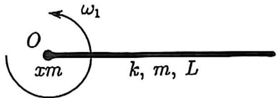

1. (40 分)

解：(1) 位于 $r \sim  {rdr}$ 阶

$$
e ^ {x} T = \frac {k L}{d x} (d r - d x) = k L (\frac {d r}{d x} - 1)
$$

$$
\begin{array}{l} \therefore d T = k L \frac {d ^ {2} r}{d x ^ {2}} d x \\ \therefore k L \frac {d ^ {2} r}{d x ^ {2}} d x = - \frac {m}{L} d x w _ {1} ^ {2} r \\ \mathrm {即} \frac {d ^ {2} r}{d x ^ {2}} = - \frac {z ^ {2}}{9} \frac {r}{L ^ {2}} \\ \therefore \frac {d r ^ {1}}{d r} r ^ {1} = - \frac {\pi^ {2}}{9} \frac {r}{l ^ {2}} \Rightarrow 3 r ^ {1 2} = - \frac {\pi^ {2}}{9} \frac {r ^ {2}}{l ^ {2}} + C _ {1} \\ \end{array}
$$

移项并 积分：

$$
\frac {3 c}{2} \arctan^ {1 0} \sqrt {\frac {x ^ {2}}{9 c ^ {2}}} r = x + \delta_ {2}
$$

$$
\therefore r = \sqrt {\frac {9 L ^ {2} c}{\pi^ {2}}} \sin h \frac {\pi x}{3 L}
$$

$$
\therefore \sqrt {c _ {1}} \cos \frac {\pi}{3} = 1 \Rightarrow \sqrt {c _ {1}} = \frac {1}{\cos \frac {\pi}{3}}
$$

$$
\therefore r = \frac {3 4}{x \cos \frac {\pi}{3}} \sin \frac {\pi x}{3 2} \quad \frac {3 2}{x} \quad \frac {\sin \frac {\pi x}{3 2}}{\cos \frac {\pi}{3}}
$$

$$
R = \frac {3 L}{\pi} \tan \frac {\pi}{3} = 0. 7 4 6 \mathrm {L} 1. 6 5 \mathrm {L}
$$

$$
\begin{array}{l} I _ {1} = \int \frac {m}{L} d x r ^ {- 2} = \int_ {0} ^ {L} \frac {9}{x ^ {2}} m L \frac {\sin^ {2} \frac {2 x}{3 L}}{\cos^ {2} \frac {x}{3}} d x \\ = - \frac {9}{\pi^ {2}} \frac {m L}{\cos h ^ {2} \frac {\pi}{3}} \cdot (\frac {1}{4} \sin h \frac {2 \pi}{3} - \frac {L}{2}) Q \\ \end{array}
$$

$$
\begin{array}{l} \therefore I _ {1} = m L ^ {2} - \frac {9}{x ^ {2} \cos^ {2} \frac {\pi}{3}} (- \frac {3}{4 2} \sin \frac {2 \pi}{3} + \frac {1}{2}) \\ I _ {1} = 0. 4 2 m l ^ {2} 1. 0 7 m L ^ {2} \\ \end{array}
$$

$$
\begin{array}{l} (3) \mathrm {此 时} r = \sqrt {\frac {3 6 c ^ {2}}{x ^ {2}} c _ {2}} \sin \theta \frac {\pi x}{6 c} \\ \therefore k L (\sqrt {c _ {2}} \cos \frac {\pi}{6} - 1) = x m \omega^ {2} \frac {6 c}{\pi} \sqrt {c _ {2}} \sin \frac {\pi}{6} \\ \end{array}
$$

$$
\begin{array}{l} I = x m c _ {2} \sin^ {2} \frac {\pi}{6} \cdot \frac {3 6 L ^ {2}}{\pi^ {2}} + \int_ {0} ^ {L} \frac {m}{L} d x \cdot \frac {3 6 L ^ {2}}{\pi^ {2}} c _ {2} \sin^ {2} \frac {\pi x}{6 L} d x \\ I _ {1} \omega_ {1} = I \omega_ {2} \\ \end{array}
$$

得 $x = 0 \cdot  {726}$